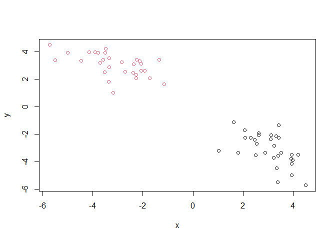

# Class 7: Machine Learning 1
Deborah Sigaud Kutner (PID: A69027018)
2024-01-31

Today we are going to explore some core machine learning methods. Namely
clustering and dimensionality reduction approaches.

# Kmeans clustering

The main function for k-means in “base” R is called ‘kmeans()’. Let’s
first make up some data to see how kmeans works and to get a look at the
results.

Make a vector with 60 total points half centered at +3 and half centered
at -3.

``` r
vector <- c(rnorm(30, mean = 3), rnorm(30, mean = -3))
plot(vector ~ rev(vector))
```


``` r
x <- cbind(x=vector, y=rev(vector))
plot(x[,1] ~ x[,2])
```


Run ‘kmeans()’ asking for two clusters:

``` r
k <- kmeans(x, centers=2, nstart=20)
k
```

    K-means clustering with 2 clusters of sizes 30, 30

    Cluster means:
              x         y
    1 -3.102939  3.052653
    2  3.052653 -3.102939

    Clustering vector:
     [1] 2 2 2 2 2 2 2 2 2 2 2 2 2 2 2 2 2 2 2 2 2 2 2 2 2 2 2 2 2 2 1 1 1 1 1 1 1 1
    [39] 1 1 1 1 1 1 1 1 1 1 1 1 1 1 1 1 1 1 1 1 1 1

    Within cluster sum of squares by cluster:
    [1] 58.04282 58.04282
     (between_SS / total_SS =  90.7 %)

    Available components:

    [1] "cluster"      "centers"      "totss"        "withinss"     "tot.withinss"
    [6] "betweenss"    "size"         "iter"         "ifault"      

``` r
attributes(k)
```

    $names
    [1] "cluster"      "centers"      "totss"        "withinss"     "tot.withinss"
    [6] "betweenss"    "size"         "iter"         "ifault"      

    $class
    [1] "kmeans"

What is my clustering result? i.e. what cluster does each point reside
in?

``` r
k$cluster
```

     [1] 2 2 2 2 2 2 2 2 2 2 2 2 2 2 2 2 2 2 2 2 2 2 2 2 2 2 2 2 2 2 1 1 1 1 1 1 1 1
    [39] 1 1 1 1 1 1 1 1 1 1 1 1 1 1 1 1 1 1 1 1 1 1

> Q. Plot your data ‘x’ showing your clustering result and the center
> point for each cluster?

``` r
plot(x, col=k$cluster)
points(k$centers, pch = 15, col = ("blue"))
```


> Q. Run kmeans, cluster into 3 groups and plot the result

``` r
k2 <- kmeans(x, centers=3, nstart=20)
plot(x, col=k2$cluster)
points(k2$centers, pch = 15, col = ("blue"))
```


The big limitation of k-means is that it imposes a structure on your
data (i.e. a clustering) that you ask for in the first place. You have
to give a number of clusters in order to work.

# Hierarchical clustering

The main function in “base” R for this is called ‘hclust()’. It wants a
distance matrix as input not the data itself. We can calculate a
distance matrix in lots of different ways but here we will use the
‘dist()’ function.

Starts by making the same number of clusters as the number of points and
then goes down and down in iterations (top-down). It can also be
bottom-up.

``` r
d <- dist(x, diag = T)
hc <- hclust(d)
plot(hc)
abline(h=8, col="red")
```


To get the cluster membership vector we need to “cut” the tree at a
given height that we pick. The function to do this is called ‘cutree()’.

``` r
grps <- cutree(hc, h=8) # you can also cut the tree in number of clusters (e.g. k=2)
plot(x, col=grps)
```



# Principal Component Analysis (PCA)

Eigenvectors: lines of fit to your data. Each one explains a percentage
of variance. PC1 is the best one and it goes on. The data is always
going to be more spread in 1, then 2, etc., because they capture
variance in that order.

``` r
# Loading data
url <- "https://tinyurl.com/UK-foods"
data <- read.csv(url, row.names = 1)
pairs(data) # scatter plots between the columns
```


The main function to do PCA in “base” R is called ‘prcomp()’. It wants
the foods as the columns and the countries as the rows, so we have to
transpose the data.

``` r
pca <- prcomp(t(data))
summary(pca)
```

    Importance of components:
                                PC1      PC2      PC3       PC4
    Standard deviation     324.1502 212.7478 73.87622 3.176e-14
    Proportion of Variance   0.6744   0.2905  0.03503 0.000e+00
    Cumulative Proportion    0.6744   0.9650  1.00000 1.000e+00

``` r
attributes(pca)
```

    $names
    [1] "sdev"     "rotation" "center"   "scale"    "x"       

    $class
    [1] "prcomp"

``` r
pca$x  #The values on the new vector for each country
```

                     PC1         PC2        PC3           PC4
    England   -144.99315   -2.532999 105.768945 -4.894696e-14
    Wales     -240.52915 -224.646925 -56.475555  5.700024e-13
    Scotland   -91.86934  286.081786 -44.415495 -7.460785e-13
    N.Ireland  477.39164  -58.901862  -4.877895  2.321303e-13

``` r
plot(pca$x[,1], pca$x[,2], xlab="PC1 (67.4%)", ylab = "PC2 (29.05%)", col=c("orange", "red", "blue", "darkgreen"), pch=16)
abline(h=0, col="gray", lty=2)
abline(v=0, col="gray", lty=2)
```


Ireland (green) is the most different country.
